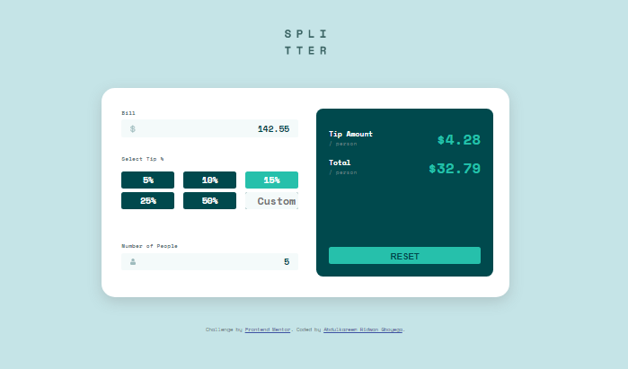

# Frontend Mentor - Tip calculator app solution

This is a solution to the
[Tip calculator app challenge on Frontend Mentor](https://www.frontendmentor.io/challenges/tip-calculator-app-ugJNGbJUX).
Frontend Mentor challenges help you improve your coding skills by building
realistic projects.

## Table of contents

- [Overview](#overview)
  - [The challenge](#the-challenge)
  - [Screenshot](#screenshot)
  - [Links](#links)
- [My process](#my-process)
  - [Built with](#built-with)
  - [What I learned](#what-i-learned)
  - [Continued development](#continued-development)
  - [Useful resources](#useful-resources)
- [Author](#author)
- [Acknowledgments](#acknowledgments)

**Note: Delete this note and update the table of contents based on what sections
you keep.**

## Overview

I embarked on this challenge coming off the first project I will like to
identify myself with as done using vanilla js. This was much more fun and easy

### The challenge

The requirements are that the users should be able to:

- View the optimal layout for the app depending on their device's screen size
- See hover states for all interactive elements on the page
- Calculate the correct tip and total cost of the bill per person

### Screenshot



### Links

- Solution URL:
  [Solution](https://github.com/reedwane/frontendmentorpages/tree/main/tip-calculator-app-main)
- Live Site URL:
  [Live site](https://reedwane.github.io/frontendmentorpages/tip-calculator-app-main/)

## My process

### Built with

- Semantic HTML5 markup
- CSS custom properties
- Flexbox
- CSS Grid
- Mobile-first workflow
- Vanilla javascript
- Async js
- Fetch API

### What I learned

I learned quite a lot, this being my second time of doing a Javascript project.
I improved on my knowledge on DOM manipulation and also altering css styles
based on events triggered by the user.

Some codes I am happy i was able to write, even though I am really very happy
about the project as a whole, I would just pick this javascript lines of code

````
```js
	//the function for recalculating the amounts when new inputs are made
	const update = (people, tipAmount, totalAmount, bill, percent) => {
		tipAmount = calcTipAmount(bill, percent, people);
		totalAmount = calcTotalAmount(bill, tipAmount, people);

		document.querySelector("#tip-amount").innerText = `$${tipAmount.toFixed(
			2,
		)}`;
		document.querySelector("#total-amount").innerText = `$${totalAmount.toFixed(
			2,
		)}`;

		reset.style.opacity = 2;
	};
````

### Continued development

I have learnt quite more about HTML, CSS and JavaScript with this project, and
I'll keep trying to get a good grasp of these basics. I want to learn more about
flexbox and css grid, and also learn a javascript framework

### Useful resources

I guess the resources I really enjoy are stackoverflow ;) and w3schools. I guess
they are just general. But I've found
[NetNinja](https://www.youtube.com/channel/UCW5YeuERMmlnqo4oq8vwUpg) very very
very helpful in learning Javascript.

## Author

- Website - [Abdulkareem Ridwan Gboyega](https://github.com/reedwane)
- Frontend Mentor - [@reedwane](https://www.frontendmentor.io/profile/reedwane)

## Acknowledgments

I am very much grateful to Omoalfa who charged me with completing this project
and shared the tutorial playlist with me, It really helped a lot. I also
acknowledge the support of Iremide who keeps my company and checks on my
progress.
